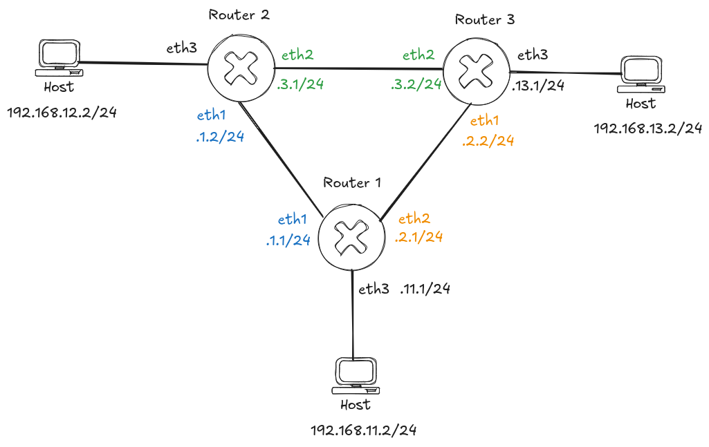

# Laboratorio de ejemplo OSPF




## Iniciar topología
```bash
sudo containerlab deploy --topo frr_ospf_lab.yml
```

## Remover topología
```bash
sudo containerlab destroy --topo frr_ospf_lab.yml
```

## Iniciar topología con configuraciones de PC usando script
```bash
sudo ./init_lab.sh
```
## Captura de paquetes

### Ver namespaces creados
```bash
sudo ip netns show
```

### Captura con tcpdump
```bash
sudo ip netns exec clab-frr_ospf_lab-router3 tcpdump -U -n -i eth1 -w capture.pcap
```

## Captura con tshark
```bash
sudo ip netns exec clab-frr_ospf_lab-router3 tshark -i eth1 -w /tmp/capture.pcap
```
## Visualizar capturas

### Con tshark
```bash
sudo tshark -r /tmp/tshark_capture.pcap
```
### Con Wireshark
```bash
sudo wireshark capture.pcap
```
## Interaccion con equipos

## Comandos de pruebas ping y traceroute
```bash
docker exec -it clab-frr_ospf_lab-PC1 traceroute 192.168.13.2
docker exec -it clab-frr_ospf_lab-PC1 ping -c4 192.168.13.2
```
### Dar de baja o alta un enlace
```bash
docker exec -d clab-frr_ospf_lab-router1 ip link set dev eth2 down
docker exec -d clab-frr_ospf_lab-router1 ip link set dev eth2 up
```
