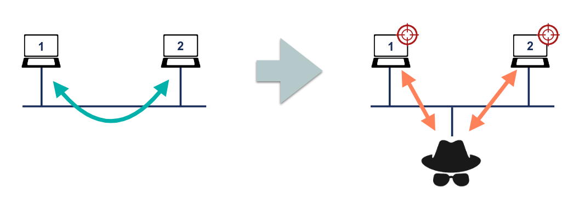

# Laboratorio de seguridad en IPv6

Este laboratorio explora una de las vulnerabilidades más comunes en redes IPv6: NDP Spoofing (Neighbor Discovery Protocol Spoofing). Se utiliza una topología en containerlab que permite simular y analizar este tipo de ataque, así como implementar mecanismos de mitigación.

NDP Spoofing (también conocido como Neighbor Discovery Protocol Spoofing) es un tipo de ataque que explota el protocolo NDP, utilizado en redes IPv6 para tareas como la resolución de direcciones IP a direcciones MAC, la detección de enrutadores, y la configuración automática de direcciones. 

Funciona como un ataque de hombre en el medio (MITM) en donde el atacante se inserta entre dos partes comunicantes creando la posibilidad de que el atacante descarte, lea o modifique los mensajes antes de que lleguen al destinatario previsto.



Al igual que en ARP Spoofing, el atacante envía mensajes falsos para engañar a los dispositivos de la red, logrando que asocien una dirección IPv6 legítima con la dirección MAC del atacante. Esto le permite interceptar, manipular o redirigir el tráfico de la red.

En este laboratorio, se demuestra cómo un atacante puede utilizar mensajes de Router Advertisement (RA) para hacerse pasar por un router. De esta manera, el atacante intenta que las víctimas lo configuren como su puerta de enlace predeterminada.
Para mitigar este ataque, se implementa RA-Guard, que bloquea la comunicación no autorizada en capa 2, permitiendo solo al router legítimo enviar paquetes a través de la dirección multicast de enlace local.

## Ejemplos 

### Despliegue sin Seguridad

Este escenario utiliza una topología básica con dos máquinas Linux para demostrar la facilidad con la que se pueden ejecutar ataques NDP Spoofing.

#### Inicializar la topologia

```bash
sudo clab deploy -t ipv6-nosec-lab.yml
```

#### Acceso a los dispositivos

```bash
# PC1 (Kali Linux)
docker exec -it clab-ipv6-nosec-PC1 /bin/bash
# PC2 (Network-Multitool)
docker exec -it clab-ipv6-nosec-PC2 /bin/bash
```

#### Iniciar el ataque

```bash
# Ejecutamos el NDP Spoofing -> PC1
atk6-fake_router6 eth1 2001:db8:ffff:1::/64
# Comprobamos las ipv6 de nuestra PC2
ifconfig
```

### Despligue con Seguridad

En este escenario, se demuestra cómo mitigar el ataque utilizando RA-Guard.

#### Clonar repositorio

```bash
git clone https://github.com/ernestosv73/ipv6seclab
```

#### Acceso a los nodos Linux

```
# PC1 (Kali Linux)
docker exec -it clab-ipv6-nosec-PC1 /bin/bash
# PC2 (Kali Linux)
docker exec -it clab-ipv6-nosec-PC2 /bin/bash
# PC3 (Network-Multitool)
docker exec -it clab-ipv6-nosec-PC3 /bin/bash
```

#### Acceso a los nodos SRL (SRL1 y SRL2)

```bash
ssh admin@clab-ipv6sec-SRL1 o ssh admin@clab-ipv6sec-SRL2
password: NokiaSrl1!
```
#### Implementacion de RA-Guard en el nodo SRL2

```
# Ingresamos al modo de configuracion
enter candidate
# Aplicamos la ra guard
interface mgmt0 subinterface 0 ra-guard policy "Discard All"
# Guardamos los cambios
commit stay
```

Para finalizar, realiza pruebas en el escenario utilizando los comandos del apartado anterior. Observa cómo el ataque es mitigado eficazmente.

