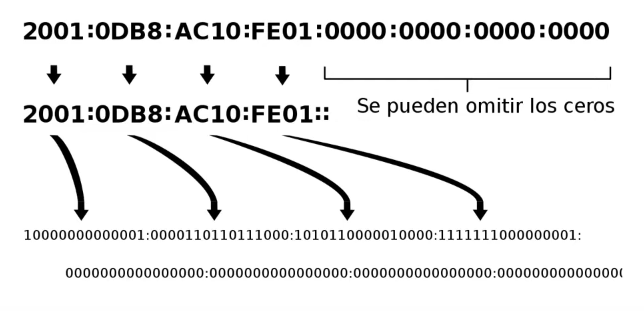
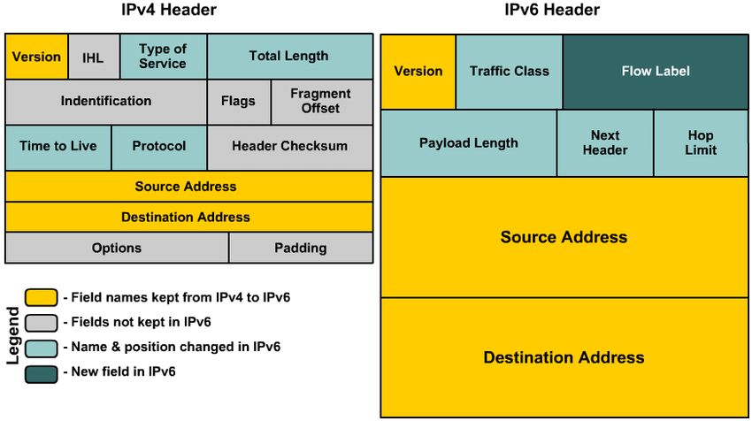
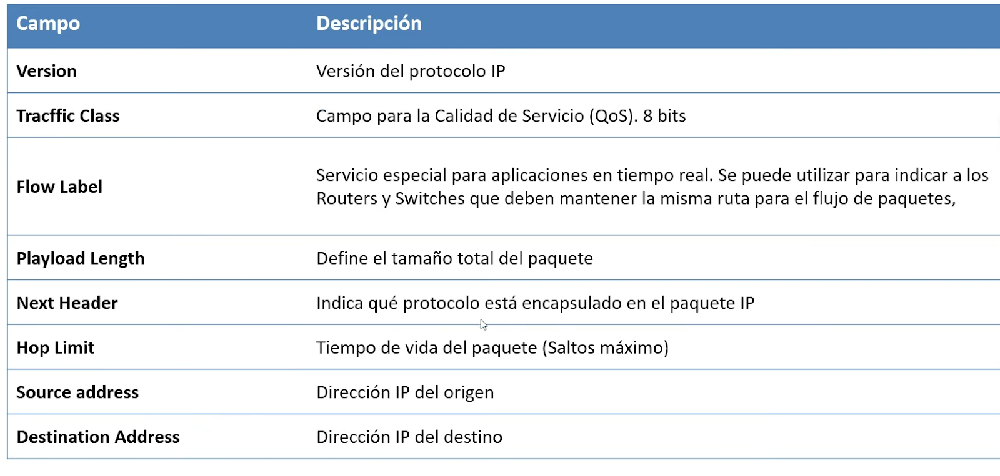
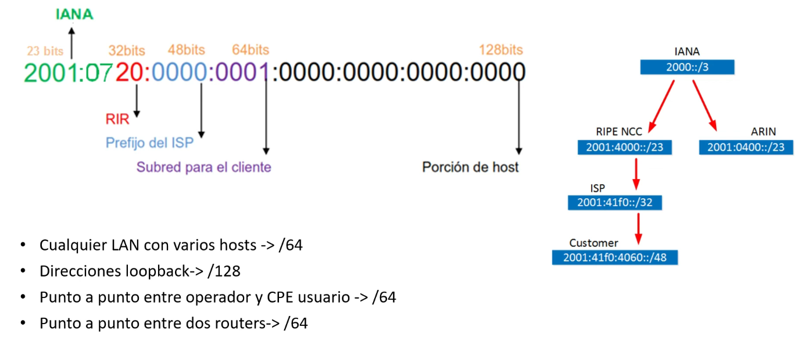
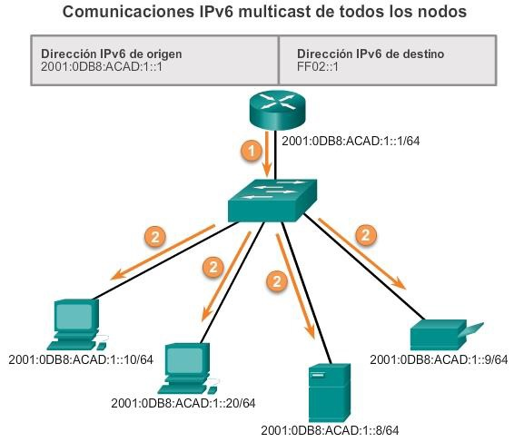
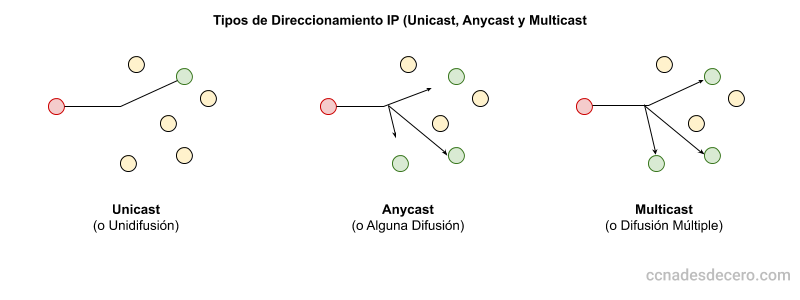
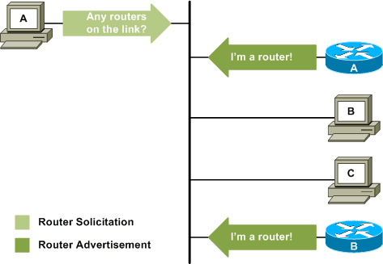
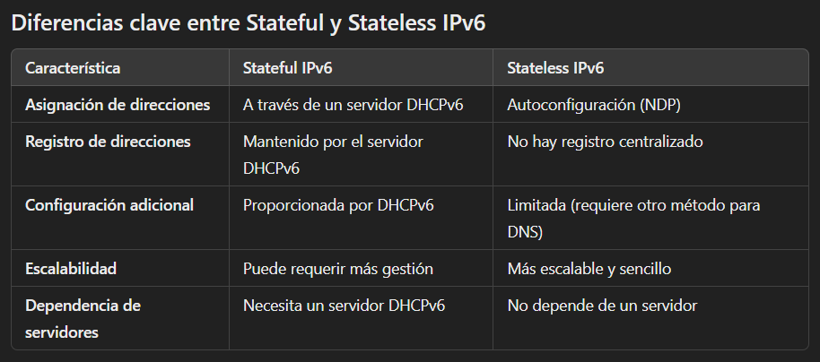

# Fundamentos de IPv6

## IPv6

IPv6 es un protocolo de Internet que fue desarrollado por Internet Engineering Task Force (IETF) y presentado en 1998. Nace debido al agotamiento de direcciones IPv4 y presenta algunas mejoras como:

- Auto configuración de direcciones
- Fragmentación de paquetes
- IPSec
- Mayor cantidad de direcciones
- Elimina la necesidad de Broadcast

Las direcciones IPv6 se representan en formato hexadecimal en donde los 128 bits se dividen en 8 bloques de 16 bits cada uno separados entre si por el símbolo 2 puntos (:)

Se pueden simplificar las direcciones utilizando 2 símbolos de 2 puntos (::) si se presentan varios bloques con ceros consecutivos o también se pueden obviar los ceros que se encuentran al principio del bloque.

La mascara de red funciona de la misma manera que en IPv4, recordemos que nos indica la cantidad de host que puede tener una red.

Desde el punto de vista del protocolo, observamos que el encabezado se simplifica pero no se hace mas pequeño ya que se fija en 40 bytes pero se eliminan algunos campos mejorando el rendimiento.

Se pueden añadir distintos encabezados al payload dependiendo de la función que se quiera utilizar.

## Plan de direccionamiento

IANA Internet Assigned Number Authority delega porciones de direcciones globales IPv6 a los Registros Regionales de Internet (RIR), en donde se dividen distintas regiones:

- American Registry for Internet Numbers (ARIN)

- RIPE Network Coordination Centre (RIPE NCC)

- Asia-Pacific Network Information Centre (APNIC)

- Latin Ametican and Caribbean Internet Address Registry (LACNIC)

- African Network Information Centre ( AfriNIC)

La IANA sigue el RFC 3513 que indica que el identificador de la interfaz debe ser /64 en formato EUI-64 siempre que sea posible

## Tipos de Direcciones

Las direcciones IPv6 se dividen en 3 grandes grupos

### Direcciones Unicast

- Globales: Tiene alcance ilimitado en la Internet, son equivalentes a la direcciones publicas de IPv4, están asignadas por la IANA. La usamos para comunicarnos en el Internet.
- Link-Local: Se usa para comunicarse con otros dispositivos en el mismo enlace local, se configuran de forma automática siempre y cuando la interfaz lo permita. Se usa para la autoconfiguracion de direcciones, IGP o NDP. La creación de estas direcciones dependen de la dirección MAC
- Loopback: Utilizado para comprobar funcionamiento de la interfaz de red
- Direcciones no especificadas: No se puede configurar
- Unique Local: Equivalentes a la direcciones privadas de IPv4 para comunicarse dentro de una red privada.
- IPv4 embebidas: Usada para tecnicas de traslación 6to4

### Direcciones Multicast

Una direccion multicast identifica a un grupo de interfaces en donde estan autorizadas a recibir la transmisión y viene para reemplazar al concepto de broadcast en IPv4. Multicast es mas eficiente y escalables cuando se trata de distribuir información.

Las IPv6 Multicast comienza con FF00::/8, es decir todas direcciones que inician con los dos primeros dos byte en unos (1111 1111 = FF) son una  dirección Multicast

### Direcciones Anycast

Una direccion Anycast es una direccion que es asignada a un grupo de interfaces que tipicamente pertenece a diferentes nodos. Un paquete enviado a este tipo de direcciones es solamente recibido por la interfaz mas cercana (definido por el protocolo de ruteo). Las direcciones anycast son muy parecidas a las unicast, asignar una direcciones unicast a mas de una interfaz la convierte en una direcciones anycast. Funciona como una especie de redundancia en caso de que se caiga un host.

### Direcciones Solicited-Node

Es una direccion IP creada por cada IP presente en una interfaz. Se usa para descubrir la direccion MAC de un vecino y tiene la forma FF02:1:FF00:0000/104

## Neighbor Discovery Protocol (NDP)

NDP (Neighbor Discovery Protocol) es un protocolo utilizado en redes IPv6 para facilitar la comunicación entre nodos en la misma red. Este protocolo reemplaza funciones de ARP (Address Resolution Protocol) en IPv4 y permite realizar tareas como:

- Resolución de dirección
- Descubrimiento de routers
- Autoconfiguracion de direcciones
- Detección de direcciones IP duplicadas

Los mensajes de NDP (Neighbor Discovery Protocol) se basan en ICMPv6 y se clasifican en cinco tipos principales:

- **Router Solicitation (RS):** Los nodos envían este mensaje para solicitar información de configuración a los routers en la red.

- **Router Advertisement (RA):** Los routers responden a los mensajes RS o envían estos mensajes  periódicamente para proporcionar información, como prefijos de red,  tiempos de vida, y opciones de configuración de nodos.

- **Neighbor Solicitation (NS):** Se utiliza para resolver direcciones MAC a partir de direcciones IP,  verificar si un vecino sigue activo, o comprobar duplicidad de  direcciones IP (DAD).

- **Neighbor Advertisement (NA):** Es la respuesta a un mensaje NS, proporcionando la dirección MAC asociada a una dirección IP o confirmando actividad en la red.

- **Redirect:** Permite a los routers informar a los nodos sobre una ruta más eficiente para alcanzar un destino.

## Stateful vs Stateless

En el contexto de la configuración de direcciones IPv6, existen dos tipos principales de autoconfiguración: Stateful (con estado) y Stateless (sin estado).

### Stateful (con estado)
En la configuración stateful, el dispositivo recibe su configuración de red mediante un servidor DHCPv6 (Dynamic Host Configuration Protocol para IPv6).

El servidor DHCPv6 asigna una dirección IPv6 específica a cada dispositivo y mantiene un registro (o estado) de qué dirección está asignada a cada uno, asegurando que cada dispositivo tenga una dirección única.

Además de la dirección, el servidor DHCPv6 puede proporcionar información adicional de configuración, como la dirección de la puerta de enlace predeterminada y los servidores DNS.

### Stateless (sin estado)
En la configuración stateless, el dispositivo se autoconfigura su dirección IPv6 utilizando Neighbor Discovery Protocol (NDP) sin necesidad de un servidor DHCPv6.

El dispositivo genera su dirección basándose en el prefijo anunciado por el router de la red, combinándolo con su identificador de interfaz (por lo general, basado en su dirección MAC).

En este caso, el router proporciona el prefijo de red, pero no mantiene un registro de las direcciones asignadas a cada dispositivo, ya que la asignación es gestionada localmente por cada dispositivo.

### Diferencias

Cada método tiene sus aplicaciones: Stateful es útil en entornos donde se requiere control y seguimiento centralizado, mientras que Stateless es adecuado para redes más simples o cuando se desea minimizar la infraestructura necesaria para la configuración de dispositivos en la red.