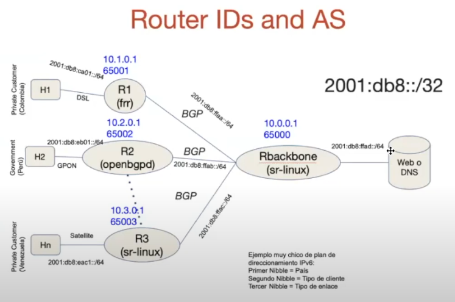

# Ejemplo IPv6 



## Clonar repo
```bash
git clone https://github.com/alejo-guevara/ipv6-workshop
```

## Comandos para acceder a los nodos

### For SRL Node (Rbackbone and R3)
```bash
ssh admin@clab-ipv6-ws-Rbackbone
```
```bash

password: NokiaSrl1!

show network-instance default protocols bgp neighbor

show interface
```

### For FRR Node (R1)
```bash
sudo docker exec -it clab-ipv6-ws-R1 vtysh
```
```bash
show interface 
show ipv6 route
show bgp ipv6 neighbors
```

### For OpenBGPD Node (R2)
```bash
sudo docker exec -it clab-ipv6-ws-R2 ash
```
```bash
ip -6 add sh

ip -6 route

bgpctl show summary

bgpctl show neighbor
```
### For Linux Clients and Server:
```bash
sudo docker exec -it clab-ipv6-ws-C1 /bin/bash
```
```bash
ip -br -c -6 add sh

ip -6 route
```


## Resumen ip servidor y cliente

| **Dispositivo**       | **Nombre**               | **Dirección IPv6**         |
|-----------------------|--------------------------|----------------------------|
| **Server**            | clab-ipv6-ws-Server      | 2001:db8:ffad::2        |
| **C1**                | clab-ipv6-ws-C1          | 2001:db8:ca01::2        |
| **C2**                | clab-ipv6-ws-C2          | 2001:db8:eb01::2           |
| **C3**                | clab-ipv6-ws-C3          | 2001:db8:eac1::2           |


## Pruebas 
```bash
docker exec -it clab-ipv6-ws-C1 curl -6 http://[2001:db8:ffad::2]
```
```bash
docker exec -it clab-ipv6-ws-C1 traceroute6 2001:db8:ffad::2
```
```bash
docker exec -it clab-ipv6-ws-C1 ping6 2001:db8:ffad::2 
```

